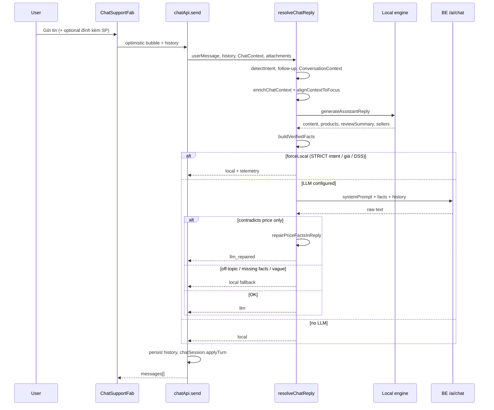

# Chatbot SEDSP — Kiến trúc & vận hành

Tài liệu tổng hợp cách trợ lý chat hoạt động sau các nâng cấp từ review kiến trúc (ChatGPT / Grok / Claude).  
Nguyên tắc cốt lõi:

> **Rules quyết định dữ liệu AI được dùng; AI quyết định cách nói; UI structured (card) luôn từ dữ liệu đã xác minh.**

---

## 1. Tổng quan

| Thành phần | Vai trò |
|------------|---------|
| **Local engine** (`engine.ts`, `responses.ts`, `intents.ts`) | Intent, enrich API/mock, trả lời số liệu cứng (giá, tồn, đơn, DSS) |
| **Hybrid responder** (`responder.ts`) | Local trước → `verifiedFacts` → LLM diễn đạt → fallback/sửa nếu lệch |
| **Backend AI** (`/api/.../ai/chat` qua `llm.ts`) | Groq/OpenAI proxy; không thay engine catalog |
| **UI** (`ChatSupportFab`, `ChatPanel`, mini cards) | Bubble, card SP/shop/review, badge nguồn, gợi ý câu hỏi |
| **Pinia** (`chatWidget`, `chatSession`) | Widget mở/đính kèm; working memory phiên chat |

Chat chạy **FE-heavy**: lịch sử lưu `localStorage` theo `userId`; BE chỉ cung cấp dữ liệu thật + endpoint AI.

---

## 2. Luồng một lượt hỏi–đáp



---

## 3. Working memory (`conversationContext.ts`)

Không lưu sở thích lâu dài — chỉ **phiên hiện tại**:

| Field | Ý nghĩa |
|-------|---------|
| `currentProduct` | SP đang bàn (đính kèm hoặc card gần nhất) |
| `lastResults` | Tối đa 4 SP từ kết quả tìm/so sánh |
| `activeTask` | `browse` \| `product_qa` \| `compare` \| `order` \| `cart` \| `seller_ops` \| … |
| `lastIntent` | Intent lượt trước |

- Khởi tạo từ lịch sử + đính kèm: `buildConversationContext`.
- Cập nhật sau mỗi lượt: `updateConversationContext`.
- **Reset** khi: `chatApi.clear`, logout (`auth` → `chatSession.resetSession`), hoặc user đổi chủ đề rõ (`isClearTopicSwitch`).

Store: `stores/chatSession.ts` — `conversation`, `lastTelemetry`.

---

## 4. Intent & routing

### 4.1 Phát hiện intent

- `intents.ts` + `match.ts`: keyword/score theo role (guest/customer/seller/manager).
- Follow-up không nhắc tên SP: `followup.ts` → `resolveFollowUpIntent` trong `responder.ts`.
- Đính kèm + “khách thấy sao”: ép `product_review`.

### 4.2 STRICT local (không gọi LLM)

Chỉ các intent **số liệu cứng**:

- Giá / tồn / rẻ nhất / lọc giá
- Đơn hàng, giỏ
- Seller/manager: DSS, doanh thu, tồn, đơn, KPI…

**Không** ép local thuần cho: `product_info`, `product_review`, `contact_seller`, `compare` — dùng **hybrid** (local facts + LLM / card structured).

Follow-up ngắn về giá/tồn/review vẫn `forceLocal` qua `shouldForceLocal`.

### 4.3 Hybrid & fallback LLM

1. Local sinh draft + `verifiedFacts` (`verifiedFacts.ts`).
2. LLM nhận system prompt + facts bắt buộc bám số.
3. Kiểm tra (`preferLocalOverLlm`):
   - Off-topic platform boilerplate
   - Chất lượng thấp / quá ngắn
   - Thiếu giá/tồn/ tên SP đã xác minh
   - **Mâu thuẫn giá** → thử `repairPriceFactsInReply` trước khi bỏ LLM
4. `finalSource`: `local` \| `llm` \| `llm_repaired`

---

## 5. Enrichment & focus SP

| Bước | File | Mục đích |
|------|------|----------|
| Enrich theo intent | `enrich.ts` | Search, reviews, inventory, DSS brief |
| Focus alignment | `responder.alignContextToFocus` | Card/text cùng một SP (tránh lệch attachment vs enrichment) |
| Review synthesis | `productReviewSummary.ts` | `ChatReviewSummary` + highlights |
| Product cards | `productCards.ts` | `ChatProductRef` đồng bộ stock |

---

## 6. Payload UI

Mỗi tin assistant có thể kèm:

| Field | UI component |
|-------|----------------|
| `content` | Markdown nhẹ (`formatChatHtml`) |
| `products` | `ChatProductMiniCard` |
| `sellers` | `ChatSellerMiniCard` |
| `reviewSummary` | `ChatReviewSummaryCard` |
| `meta.source` | Badge: **AI** / **Dữ liệu hệ thống** / **AI · đối chiếu dữ liệu** |
| `meta.suggestedActions` | Chip gợi ý câu tiếp (`suggestedActions.ts`) |

Card luôn từ local/enrich — **không** để LLM tự bịa SKU.

---

## 7. Observability (dev)

`chatTelemetry.ts` — log console khi `import.meta.env.DEV`:

```
[chat:local] { intent, score, llm, ms, fallback, followUp, attach, task }
```

| Field | Ý nghĩa |
|-------|---------|
| `intent` / `intentScore` | Intent đã chọn |
| `llmCalled` | Có gọi BE AI không |
| `localLatencyMs` / `llmLatencyMs` | Thời gian từng pha |
| `finalSource` | Nguồn câu trả lời cuối |
| `fallbackReason` | `force_local`, `off_topic`, `contradicts_facts`, … |

Production: không log PII; telemetry chỉ trong memory (`chatSession.lastTelemetry`).

---

## 8. Lưu trữ & vòng đời phiên

| Dữ liệu | Nơi lưu |
|---------|---------|
| Lịch sử tin nhắn | `localStorage` — key chat history map theo `userId` / `guest` / `seller-{id}` |
| Working memory | Pinia `chatSession` (runtime) |
| Widget (mở/đính kèm) | Pinia `chatWidget` |

- **Xóa chat**: `chatApi.clear` → xóa history + `resetSession`.
- **Logout**: `auth.logout` → `resetSession`.
- **Lỗi gửi**: optimistic bubble rollback, nút thử lại (`ChatSupportFab`).

---

## 9. Role & context

`buildChatContext` (`context.ts`) nạp theo role:

- **Guest/customer**: catalog, giỏ, đơn (nếu đăng nhập), voucher
- **Seller**: sản phẩm shop, dashboard, DSS brief
- **Manager**: KPI, pending approvals

Quick prompts: `prompts.ts` theo role.

---

## 10. Tích hợp AI backend

- `llm.ts`: `callChatLlm` → POST BE với history + facts snippet.
- `refreshBeAiStatus` / prewarm khi mở widget.
- Không LLM key / BE down → chạy local-only (`chatModeLabel` báo rõ).

**Không làm trong scope capstone** (cố ý hoãn):

- Streaming token SSE
- Orchestrator chat hoàn toàn trên BE
- Lịch sử server-side / multi-device sync
- Agent tool-calling framework
- Chart embed trong bubble chat

---

## 11. Test

| File | Phạm vi |
|------|---------|
| `match.test.ts` | Regex review, giá, seller |
| `followup.test.ts` | Follow-up SP, LLM quality guards |
| `productReviewSummary.test.ts` | Tổng hợp review |
| `conversationContext.test.ts` | Working memory |
| `routing.test.ts` | Fact repair, suggested actions, telemetry |
| `intents.hot.test.ts` | Intent regression |

Chạy: `npm test` trong `smart-ecommerce-dssp-frontend`.

---

## 12. Cấu trúc thư mục chính

```
src/api/chat/
  responder.ts          # Hybrid orchestrator
  engine.ts             # Local reply generator
  intents.ts / match.ts # Intent & patterns
  enrich.ts             # API enrichment
  verifiedFacts.ts      # Grounding cho LLM
  followup.ts           # Follow-up & LLM guards
  conversationContext.ts
  chatTelemetry.ts
  factRepair.ts
  suggestedActions.ts
  productReviewSummary.ts
  llm.ts / systemPrompt.ts

src/components/
  ChatSupportFab.vue    # FAB + send/retry/clear
  ChatPanel.vue         # Messages + badges + suggested chips
  ChatReviewSummaryCard.vue
  ChatProductMiniCard.vue
  ChatSellerMiniCard.vue

src/stores/
  chatWidget.ts         # UI widget state
  chatSession.ts        # Working memory + telemetry
```

---

## 13. Mở rộng sau demo (gợi ý)

1. Streaming UI khi BE hỗ trợ SSE.
2. Confidence band + “vì sao” trên panel DSS seller (độc lập timeout AI insight).
3. Thêm scenario E2E (Playwright) cho 30 câu demo.
4. Badge “verified facts count” cho debug nội bộ.

---

*Cập nhật: 2026-08-13 — sau batch nâng cấp observability, working memory, LLM routing, chat session store, UI badge & suggested actions.*
